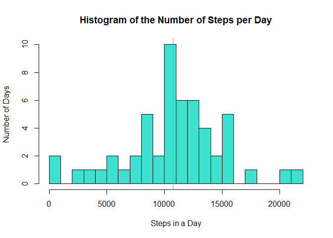
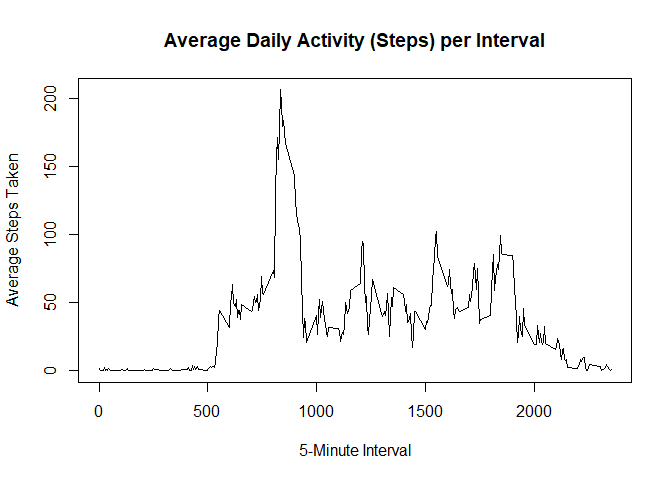
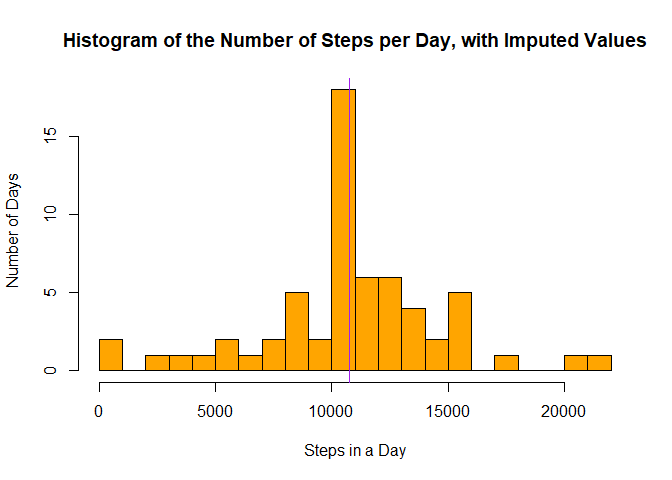
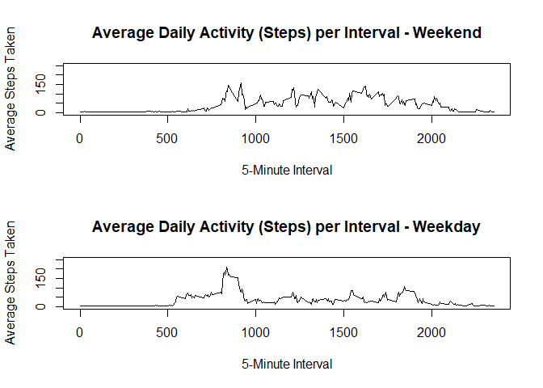

Purpose
-------

This data analysis pertains to data collected from a personal activity
monitoring device. The device collected data at 5 minute intervals
throughout the day. The dataset consists of two months of data from an
anonymous individual collected during the months of October and
November, 2012 and include the number of steps taken in 5 minute
intervals each day.

Acquire the Dataset
-------------------

The dataset was downloaded from the web from this
[URL.](https://d396qusza40orc.cloudfront.net/repdata%2Fdata%2Factivity.zip)

Here is the R code that was used to download and unzip the dataset:

    fileUrl <- "https://d396qusza40orc.cloudfront.net/repdata%2Fdata%2Factivity.zip"
    download.file(fileUrl, destfile="activity.zip")
    unzip("activity.zip", unzip="internal")

Load the Dataset
----------------

The dataset was then loaded into R and sorted by date and interval. This
required the use of the dplyr package. Finally, a new 'Date' column was
added to the dataset.

    library(dplyr)
    activity <- read.csv("activity.csv", sep=",", header=TRUE)
    activity <- arrange(activity, date, interval)
    activity$Date <- as.Date(activity$date, "%Y-%m-%d")

Data Analysis Findings
----------------------

### Steps per Day: Histogram, mean and median

In this first step of the analysis, the total number of steps per day is
calculated using the aggregate function. Missing values are ignored.
Then, a histogram of the total number of steps taken each day is shown.

    stepsperday <- aggregate(steps ~ date, activity, sum)
    hist(stepsperday$steps, breaks=20, col="turquoise",
            xlab="Steps in a Day",
            ylab="Number of Days",
            main="Histogram of the Number of Steps per Day")
    abline(v=mean(stepsperday$steps, na.rm=TRUE), col="coral")

Then the mean and median of the total number of steps taken per day are
calculated and reported.

    mean(stepsperday$steps, na.rm=TRUE)

    [1] 10766.19

    median(stepsperday$steps, na.rm=TRUE)

    [1] 10765

### The Average Daily Activity Pattern

The second step of the analysis looks at the average daily activity
pattern. The next figure shows a time series plot of the 5-minute
intervals and the average number of steps taken, averaged across all
days.

    stepsbyinterval <- aggregate(steps ~ interval, activity, mean, na.rm=TRUE)
    plot(stepsbyinterval, type="l",
         xlab="5-Minute Interval",
         ylab="Average Steps Taken",
         main="Average Daily Activity (Steps) per Interval")

The 5-minute interval (on average across all days in the dataset) that
contains the maximum number of steps is calculated as follows:

    stepsbyinterval$interval[stepsbyinterval$steps==max(stepsbyinterval$steps)]

    [1] 835

### Missing Values Analysis

There are a number of missing values in the dataset (instances where
steps=NA). Here is the calculation for this metric:

    sum(is.na(activity$steps))

    [1] 2304

This represents about 13.1 percent of the total number of observations
(17568).

Since the presence of missing steps for various days / intervals may
introduce bias into some calculations or summaries of the data, an
attempt was made to impute (guess at) the missing values. The strategy
employed was to replace the NA values with the overall average number of
steps per interval. This was done by first creating a copy of the
activity dataset, named 'imputedactivity'. Then the NA values in the new
dataset were replaced with the average number of steps per interval. The
code that does this is as follows:

    imputedactivity <- activity
    imputedactivity$steps[is.na(imputedactivity$steps)] <- round(mean(activity$steps, na.rm=TRUE))

Using the new dataset with all missing values replaced with imputed
values, the total number of steps per day is re-calculated, again using
the aggregate function. Then, a new histogram of the total number of
steps taken each day is shown.

As can be seen, the result is similar except that the new histogram has
a spike in the number of days when around 10,750 steps are recorded.
Before there were 10 such days. Now there are around 18 such days.

    stepsperday2 <- aggregate(steps ~ date, imputedactivity, sum)
    hist(stepsperday2$steps, breaks=20, col="orange",
            xlab="Steps in a Day",
            ylab="Number of Days",
            main="Histogram of the Number of Steps per Day, with Imputed Values")
    abline(v=mean(stepsperday2$steps), col="purple")

The revised mean and median of the total number of steps taken per day
are then calculated and reported.

    mean(stepsperday2$steps)

    [1] 10751.74

    median(stepsperday2$steps)

    [1] 10656

As can be seen, once the imputed values are added to the dataset, the
new mean and median calculated values, while similar, are both lower
than the original ones. The new median value appears to have dropped a
bit, as well.

### Differences in Activity Patterns - Weekdays vs Weekends

The final aspect of the activity dataset (with imputed values added) to
be analyzed is to see whether the average number of steps taken per
5-minute interval and averaged across all days differs when weekdays are
compared to weekends.

First we need to add a new factor variable to the dataset identifying
the date of the each observation as having occurred either on a weekday
or on a weekend.

    weekdays1 <- c("Monday", "Tuesday", "Wednesday", "Thursday", "Friday")
    imputedactivity$DayType <- factor((weekdays(imputedactivity$Date) %in% weekdays1), levels=c(FALSE, TRUE), labels=c('weekend', 'weekday'))

Then we need to split the dataset into two parts, one for the
observations on weekdays and one for the observations on weekend days.
For each part, we then need to calculate the average number of steps per
interval.

    weekday <- subset(imputedactivity, DayType=="weekday")
    weekend <- subset(imputedactivity, DayType=="weekend")
    stepsbyintervalweekday <- aggregate(steps ~ interval, weekday, mean)
    stepsbyintervalweekend <- aggregate(steps ~ interval, weekend, mean)

Finally, this new time series plot allows us to compare the average
number of steps taken on weekdays vs those taken on weekend days, per
5-minute interval.

    #prep for a 2 panel plot
    par(mfrow=c(2,1))

    plot(stepsbyintervalweekend, type="l",
         ylim=c(0, 250),
         xlab="5-Minute Interval",
         ylab="Average Steps Taken",
         main="Average Daily Activity (Steps) per Interval - Weekend")

    plot(stepsbyintervalweekday, type="l",
         ylim=c(0, 250),
         xlab="5-Minute Interval",
         ylab="Average Steps Taken",
         main="Average Daily Activity (Steps) per Interval - Weekday")

This concludes Project Assignment 1 of the Reproducible Research course.
